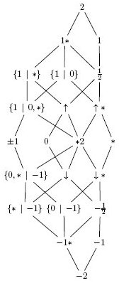
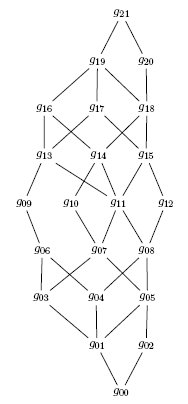
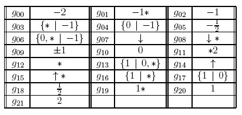
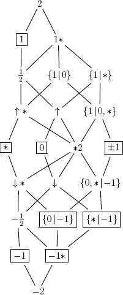

# Lattice Maker for CGT

LatticeMaker is a software that produces and displays the lattice of games born at the nth day of a initially given set of combinatorial games. LatticeMaker uses the output generated by cgsuite to produce pstricks files containing the lattice description (after a transitive reduction) so that it can be easily included in latex documents.

Here is an example (the second day of set {0}):

  

## Installation

You need to previously install

+ Java (version 6 or higher)
+ Graphviz (version 2.28 or higher)

Then download LatticeMaker (version 1.4.1), unzip it and read file README.txt.

## Use

To define what initial set of games and how many days we want to produce, edit 'latticeMaker.cgs' (a cgsuite script file) and go to its end where you will find these lines:

     games = [0];
     d1 = nextDay(games);
     d2 = nextDay(d1) >> out;
     makeDot(d2) >> out;

There are two main functions, `nextDay()` and `makeDot()`. Function `nextDay()` computes and returns the next day of a given game set. Function `makeDot()` returns a list of pairs of games (g1,g2) where g1<g2 (but you don't need to know these details). The previous example produces the 2nd day of set `{0}` (in cgsuite the set is represent by a list; notice that, syntactically, games are separated by commas, e.g., `[0,*,-1/2,{1|0},v]`).

So, in this file you need to:

+ Define the initial game set.
+ Invoke nextDay() the number of times you want (attention: the set's cardinality grows really fast).
+ Order the output the last day (using operator >> out)
+ Order the output of makeDot() for the last day

Then execute batch run.bat (or run.sh for unix/linux systems). This batch creates the next latex files:

+ graph.tex -- a pstricks lattice description
+ graph_tiny.tex -- the same lattice but with short labels
+ graph_labels.tex -- a latex table with the caption for graph_tiny.tex. The number of columns is a parameter (cf. run.bat, line 32-3)
+ irreds.tex -- a pstricks lattice description, with irreducible elements outlined
+ irreds_tiny.tex -- the same lattice but with short labels
+ irreds_labels.tex -- a latex table with the caption for irreds_tiny.tex

The zip file also includes a latex file, doc.tex, with a sample latex code showing how to embed these results in your document.

## More examples

The lattice shown above but in the short labels version:

  

And the respective caption:

  

The lattice marked with its irreducible elements:

  

## Authors

Alda Carvalho, Carlos Pereira dos Santos, Cátia Lente Dias, Francisco Coelho, João Pedro Neto, Sandra Vinagre.
